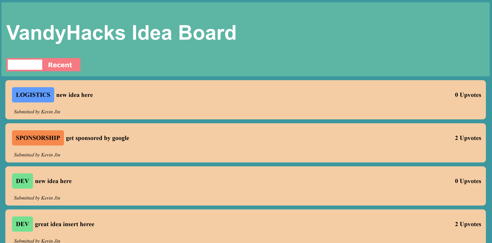
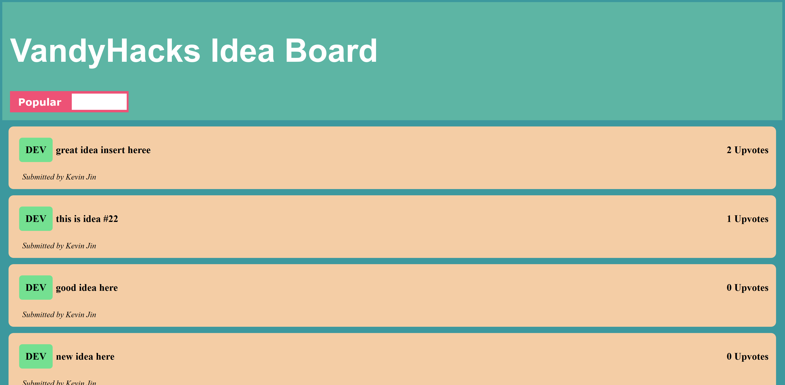

# vandyhacks-idea-website
JAMStack webapp built on React, Webpack, Babel to host VandyHack's Slack Ideas

## Purpose
The purpose of the app is to display VandyHack's Slack ideas in a cleaner and more organized fashion. On our app, we can sort ideas by Popular, which is based off the number of upvotes, or by Recent, with the most recently posted ideas at the top. We also plan to add functionality to sort by Committees in the future as well.

## Why Not Trello?
Trello is actually where we host all the idea posts. Our webapp grabs all the data off our trello board (We essentially use Trello as our database, though we'll probably switch to a real one soon). Our trello cards get somewhat messy since there is a lot of data on them, that the user doesn't need to see. For example, we store the corresponding slack thread ID, the edited slack thread ID, the number of upvotes, the committee name, and the user's name, all in limited, ugly format. We can control the design so much more by creating our own web app to host our ideas, which is what this is.

## How to Run

1. Clone this repo
2. ```npm install``` in this root directory
3. ```npm run start```
4. Go to localhost:3000

## Screenshots



